---
puppeteer:
  displayHeaderFooter: false
  margin:
    top: 3cm
    bottom: 2cm
    left: 3cm
    right: 2cm
---
<!-- markdownlint-disable MD041 MD033 -->

  
UNIVERSIDADE VEIGA DE ALMEIDA Curso de Ciência da Computação

  

    Ana Beatriz da Silva Pinto - 1250109558 
    Gabriel Bittencourt - 1250111508 
    Guilherme Brazil - 1250203978 
    Wallace Calisto - 1250115639 
    Caio Barbosa Galvão - 1250100534
  

  
Relatório das Atividades de Extensão

  
Rio de Janeiro/RJ 2026

  

    Ana Beatriz da Silva Pinto - 1250109558 
    Gabriel Bittencourt - 1250111508 
    Guilherme Brazil - 1250203978 
    Wallace Calisto - 1250115639 
    Caio Barbosa Galvão - 1250100534
  

  
Relatório das Atividades de Extensão

  
Relatório das Atividades de Extensão para cumprimento do componente curricular do Curso de Ciência da Computação da Universidade Veiga de Almeida.  Orientador: Camilla Lobo Paulino.

  
Rio de Janeiro/RJ 2026

# RESUMO

O presente relatório descreve o desenvolvimento do Projeto de Extensão II da disciplina de Algoritmos e Laboratório de Programação, que consistiu na criação de um sistema em linguagem C para controle de vendas de uma loja de varejo. O objetivo foi aplicar conhecimentos de programação estruturada para automatizar o registro de produtos, clientes e vendas, além de gerar relatórios gerenciais. O trabalho foi dividido entre os integrantes via Git: Gabriel desenvolveu a estrutura e cadastros, Wallace implementou os cálculos, Ana Beatriz criou os relatórios e desafios, Guilherme elaborou a ordenação e Caio realizou a integração e testes.

O projeto relaciona-se com o ODS 8 da Agenda 2030 ao promover modernização tecnológica e apoio ao empreendedorismo em micro e pequenas empresas. Como produto final, entregou-se um software funcional capaz de processar 50 vendas diárias e emitir relatórios diário, mensal e anual com ranking de faturamento. A experiência permitiu consolidar conceitos de `struct`, `array`, funções e ordenação, além de desenvolver habilidades de trabalho colaborativo com versionamento.

# INTRODUÇÃO

O tema deste Projeto de Extensão aborda a informatização de processos em pequenos comércios por meio do desenvolvimento de software. A estratégia metodológica adotada foi a programação modular em linguagem C, e com divisão de tarefas. A justificativa do projeto reside na necessidade de micro e pequenos varejistas terem acesso a ferramentas de gestão simples e eficientes, visto que muitos ainda operam com controles manuais sujeitos a erros. A relevância acadêmica está na aplicação prática de conteúdos como `struct`, `array`, funções e algoritmos de ordenação. O objetivo geral foi desenvolver um sistema funcional para registro de vendas diárias. Os objetivos específicos foram: implementar cadastros de produtos e clientes, desenvolver lógica de cálculo com regras de negócio, criar relatórios gerenciais e ordenar dados de faturamento. O produto final entregue é um programa em C, versionado, que registra vendas, aplica taxa de devolução e gera relatórios consolidados.

# COMUNIDADE (EXTERNA)

Para fins de simulação acadêmica, o sistema foi projetado para atender pequenos comerciantes varejistas locais, que representam a base do empreendedorismo brasileiro. A escolha se justifica pela dificuldade que esse público enfrenta para acessar softwares de gestão com baixo custo. O contexto é de lojas com média de 50 vendas diárias que necessitam de controle financeiro básico, emissão de relatórios e análise de desempenho mensal sem complexidade técnica.

# DESENVOLVIMENTO

O projeto foi executado em 5 etapas com integração via Git: 

1) Definição da arquitetura com `structs`;
2) Codificação modular;
3) Integração contínua;
4) Testes com 50 vendas/dia;
5) Validação dos relatórios.

A divisão de responsabilidades foi: Gabriel Bittencourt na estrutura e cadastros; Wallace Calisto nos cálculos e regras de negócio; Ana Beatriz da Silva Pinto nos relatórios e desafios; Guilherme Brazil na ordenação; Caio Barbosa Galvão na integração e testes.

## Relação com os Objetivos do Desenvolvimento Sustentável

O projeto relaciona-se com o ODS 8: Trabalho Decente e Crescimento Econômico. Contribui para a meta 8.2 ao promover produtividade por meio da modernização tecnológica, automatizando controles manuais e gerando dados para decisão. Alinha-se à meta 8.3 ao apoiar o empreendedorismo, pois a ferramenta é aplicável em micro e pequenas empresas, facilitando a formalização de processos e a sustentabilidade econômica, conforme atividades-chave da ONU Brasil.

## 3.3 Desafios encontrados

Os principais desafios foram: manipulação de `structs` aninhadas por Gabriel, implementação da lógica de devolução por Wallace, formatação dos relatórios por Ana Beatriz, algoritmo de ordenação decrescente por Guilherme e resolução de conflitos de `merge` no Git por Caio. As mudanças de rota incluíram refatorar funções para melhor modularidade.

## 3.4 Aprendizagens obtidas

O grupo consolidou conhecimentos em programação estruturada, trabalho com arquivos, ordenação e uso profissional do Git. Desenvolveu-se também a capacidade de dividir tarefas e integrar código de múltiplos autores.

## 3.5 Relação teoria e prática

Os conceitos de `array`, `struct` e ordenação vistos em Algoritmos foram aplicados diretamente. A prática mostrou a importância de comentar código e padronizar nomes de variáveis para trabalho em equipe.

## 3.6 Impacto na comunidade externa

Como estudo de caso simulado, o projeto demonstra como uma ferramenta simples pode reduzir tempo gasto com controles manuais e evitar prejuízos por falhas de cálculo, impactando diretamente a gestão de pequenos negócios.

## 3.7 Impacto pessoal e coletivo

Como sujeito coletivo, o grupo aprendeu a colaborar tecnicamente. Individualmente, cada integrante aprofundou sua responsabilidade: cadastro, cálculo, relatório, ordenação e testes, entendendo a importância de cada parte no produto final.

# RESULTADOS

O sistema processou com sucesso 50 vendas simuladas, gerou relatórios diário, mensal e anual corretos, e ordenou os meses por faturamento conforme requisito. A taxa de R$ 20,00 foi aplicada corretamente na segunda devolução.

## 4.2 Ferramentas

Foram utilizadas tabelas de teste para validar saídas e prints de tela para documentar a execução.

## 4.3 Reflexão

O projeto comprovou que mesmo com linguagem C é possível criar soluções úteis para o varejo. A limitação de 50 vendas é didática, mas a lógica é escalável.

## 4.4 Evidências

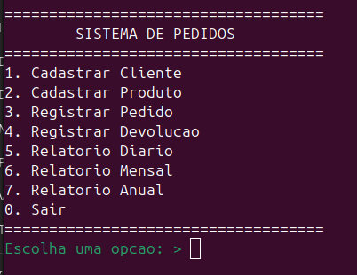
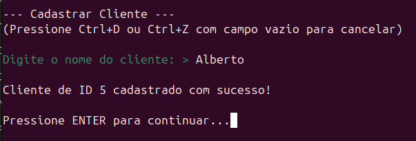
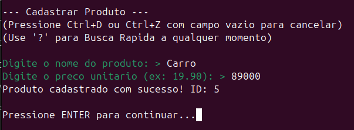
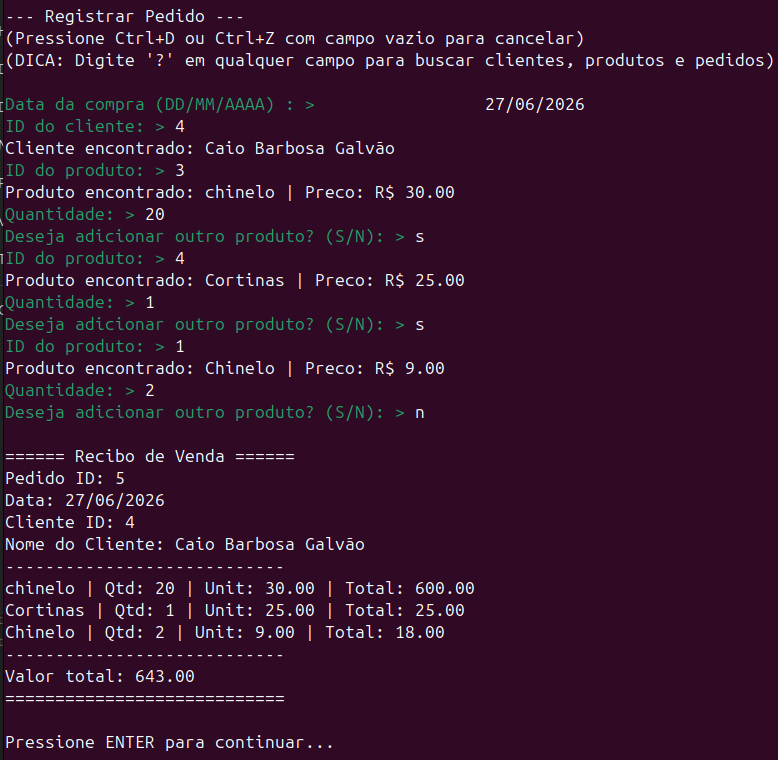
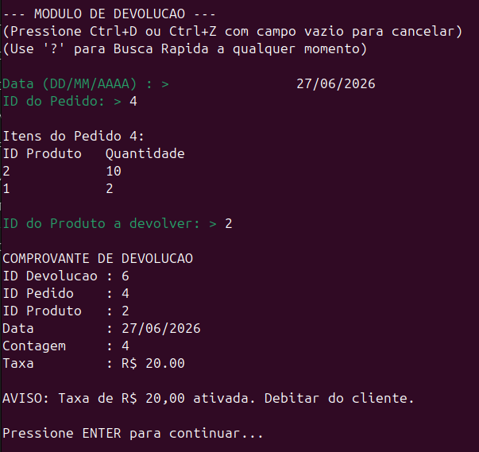
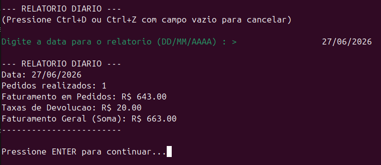
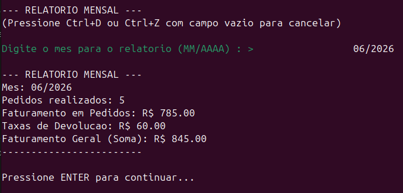
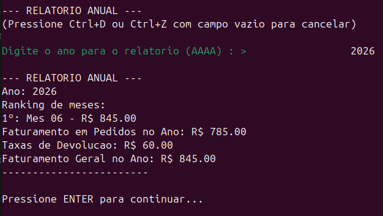
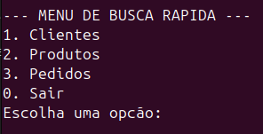
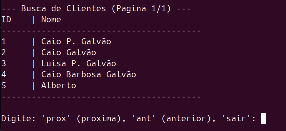
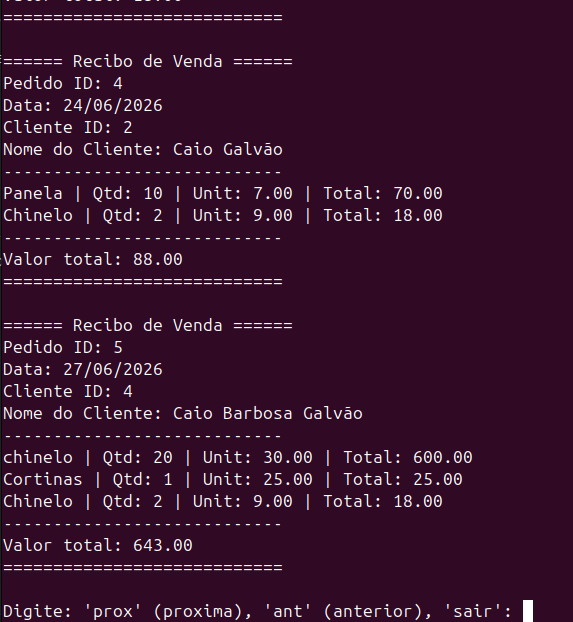
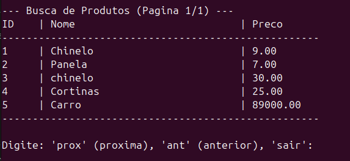
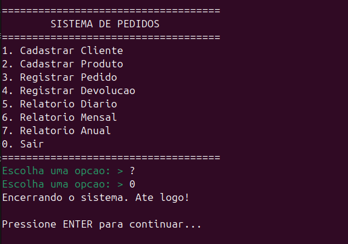

# CONSIDERAÇÕES FINAIS

O projeto atingiu seus objetivos ao entregar um sistema funcional que integra conceitos acadêmicos e demanda real de mercado. Conclui-se que a tecnologia é ferramenta essencial para o crescimento de pequenos negócios, alinhada ao ODS 8. Como desdobramento, sugere-se migrar o sistema para interface gráfica e banco de dados para uso em produção. A experiência foi fundamental para consolidar o aprendizado técnico e o trabalho em equipe.

# REFERÊNCIAS

NAÇÕES UNIDAS BRASIL. **Objetivo de Desenvolvimento Sustentável 8**. Disponível em: https://brasil.un.org/pt-br/sdgs/8. Acesso em: 4 jun. 2026.

UNIVERSIDADE VEIGA DE ALMEIDA. **Projeto de Extensão II**. Disciplina Algoritmos e Laboratório de Programação. Rio de Janeiro, 2026.

